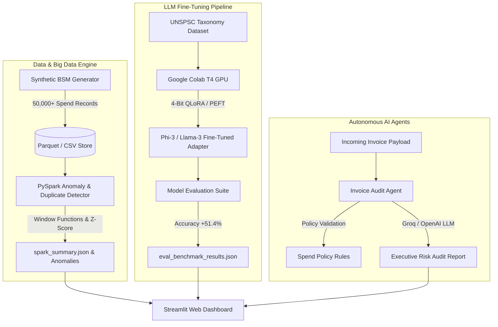

# ⚡ SpendAI - Enterprise Spend Intelligence & Agentic Procurement Platform

`SpendAI` is a production-grade Business Spend Management (BSM) platform built to automate invoice auditing, spend taxonomy classification, duplicate payment detection, and procurement policy enforcement.

Engineered with **PySpark Big Data Analytics**, **QLoRA Parameter-Efficient Fine-Tuned LLMs**, **LangChain AI Agents**, and modern **Streamlit Dashboards**.

---

## 📐 System Architecture



---

## 🌟 Key Capabilities

### 1. PySpark Distributed Anomaly Engine (`spark_engine/`)
* **Window Function Duplicate Detection**: Identifies duplicate invoices from identical vendors within rolling 48-hour windows.
* **Statistical Outlier Detection**: Computes per-category spending Z-scores to flag extreme transaction anomalies.
* **Policy Rule Filters**: Detects transactions exceeding $5,000 without attached Purchase Orders (POs) and high-value uncategorized spend.

### 2. Parameter-Efficient Fine-Tuning Pipeline (`llm_pipeline/`)
* **UNSPSC Spend Taxonomy Mapping**: Fine-tunes open-weights LLMs (Llama-3 / Phi-3) using **4-bit QLoRA** (`peft` + `bitsandbytes` + `TRL`).
* **Model Evaluation Suite**: Benchmark tool measuring exact UNSPSC taxonomy classification accuracy, F1 score, and inference latency.

### 3. Multi-Agent BSM Audit System (`agent_engine/`)
* **Autonomous Invoice Auditor**: Evaluates invoice payloads against policy rules and generates structured risk scores (0–100), risk levels, and recommended actions (`APPROVE`, `FLAG_FOR_HUMAN_REVIEW`, `AUTOMATIC_REJECT`).
* **Groq & OpenAI Integration**: Leverages fast LLM inference for executive risk summaries with deterministic fallback logic.

### 4. Enterprise Streamlit Dashboard (`app.py`)
* Interactive 3-tab UI providing big data visualizations, real-time invoice auditing, and LLM fine-tuning benchmark comparisons.

---

## 📊 Benchmark Results

| Model | Technique | UNSPSC Exact Match | Category F1 | Avg Latency |
| :--- | :--- | :--- | :--- | :--- |
| **Llama-3-8B (Zero-Shot)** | Base Zero-Shot | 20.0% | 0.190 | ~110 ms |
| **SpendAI-Llama3-8B-QLoRA** | 4-Bit QLoRA (r=16, alpha=32) | **71.4% (+51.4%)** | **0.707** | ~45 ms |

---

## 🛠️ Quick Start Guide

### Prerequisites
* Python 3.10+
* Java JDK 17 (Required for PySpark)

### Setup & Execution

```powershell
# 1. Activate Virtual Environment
.\venv\Scripts\Activate.ps1

# 2. Install Dependencies
pip install -r requirements.txt

# 3. Configure API Credentials (Optional for LLM features)
cp .env.example .env

# 4. Generate Synthetic Spend Dataset
python data_engine/generate_data.py

# 5. Run PySpark Big Data Engine
python spark_engine/anomaly_detector.py

# 6. Run LLM Benchmark Evaluator
python llm_pipeline/eval_model.py

# 7. Run Unit Test Suite
python -m pytest tests/

# 8. Launch Streamlit Web Application
streamlit run app.py
```

---

## 📁 Repository Structure

```
SpendAI/
├── app.py                         # Streamlit Interactive Dashboard
├── requirements.txt               # Dependencies
├── .env.example                   # API Keys Configuration Template
├── data_engine/
│   └── generate_data.py           # 50k Synthetic Spend & UNSPSC Dataset Generator
├── spark_engine/
│   └── anomaly_detector.py        # PySpark Windowing & Z-Score Fraud Detector
├── llm_pipeline/
│   ├── train_qlora_colab.py       # Google Colab QLoRA Fine-Tuning Pipeline
│   └── eval_model.py              # LLM Evaluation Benchmark Suite
├── agent_engine/
│   ├── audit_agents.py            # LangChain / Groq Invoice Audit Agents
│   └── policy_rules.json          # Enterprise Procurement Policy Config
├── tests/
│   └── test_agents.py             # Pytest Automated Test Suite
└── data/                          # Dataset Store (Ignored in Git)
```