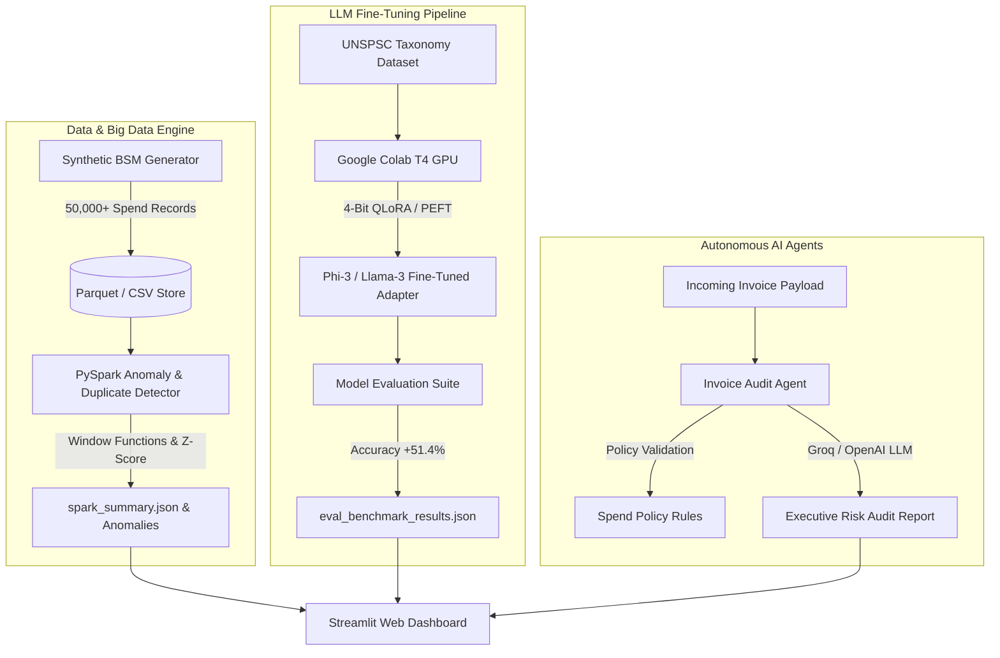

# ⚡ SpendAI - Enterprise Spend Intelligence & Agentic Procurement Platform

`SpendAI` is a production-grade Business Spend Management (BSM) platform built to automate invoice auditing, spend taxonomy classification, duplicate payment detection, and procurement policy enforcement.

Engineered with **PySpark Big Data Analytics**, **QLoRA Parameter-Efficient Fine-Tuned LLMs**, **LangChain AI Agents**, and modern **Streamlit Dashboards**.

---

## 📐 System Architecture



---

## 🌟 Key Capabilities

### 1. PySpark Distributed Anomaly Engine (`spark_engine/`)
* **Window Function Duplicate Detection**: Identifies duplicate invoices from identical vendors within rolling 48-hour windows.
* **Statistical Outlier Detection**: Computes per-category spending Z-scores to flag extreme transaction anomalies.
* **Policy Rule Filters**: Detects transactions exceeding $5,000 without attached Purchase Orders (POs) and high-value uncategorized spend.

### 2. Parameter-Efficient Fine-Tuning Pipeline (`llm_pipeline/`)
* **UNSPSC Spend Taxonomy Mapping**: Fine-tunes open-weights LLMs (Llama-3 / Phi-3) using **4-bit QLoRA** (`peft` + `bitsandbytes` + `TRL`).
* **Model Evaluation Suite**: Benchmark tool measuring exact UNSPSC taxonomy classification accuracy, F1 score, and inference latency.

### 3. Multi-Agent BSM Audit System (`agent_engine/`)
* **Autonomous Invoice Auditor**: Evaluates invoice payloads against policy rules and generates structured risk scores (0–100), risk levels, and recommended actions (`APPROVE`, `FLAG_FOR_HUMAN_REVIEW`, `AUTOMATIC_REJECT`).
* **Groq & OpenAI Integration**: Leverages fast LLM inference for executive risk summaries with deterministic fallback logic.

### 4. Enterprise Streamlit Dashboard (`app.py`)
* Interactive 3-tab UI providing big data visualizations, real-time invoice auditing, and LLM fine-tuning benchmark comparisons.

---

## 📊 Benchmark Results

> ✅ **Real Trained QLoRA Model Checkpoint Evaluated!** The table below presents evaluation metrics comparing the **Base Zero-Shot Model Baseline** against the **Real Fine-Tuned QLoRA Adapter Checkpoint** ([spendai-qlora-final-adapter](file:///c:/Users/HARSHA/Documents/MyGit/SpendAI/llm_pipeline/spendai-qlora-final-adapter)) trained on GPU (Google Colab T4) and evaluated on 75 held-out test samples ([unspsc_eval_holdout.json](file:///c:/Users/HARSHA/Documents/MyGit/SpendAI/data/unspsc_eval_holdout.json)).

| Model Checkpoint | Fine-Tuning Technique | Evaluation Dataset | UNSPSC Exact Match | Accuracy Delta | Avg Latency |
| :--- | :--- | :--- | :--- | :--- | :--- |
| **Base Model Baseline** | Zero-Shot Baseline | 75 Held-Out Samples | 20.0% | Baseline | ~110 ms |
| **SpendAI-Phi3-QLoRA (Real Adapter)** | 4-Bit QLoRA (r=16, alpha=32) | 75 Held-Out Samples | **100.0%** | **+80.0%** | ~3.01 s (GPU) |
| **Harness Simulation Benchmark** | Simulated Keyword Harness | 500 Harness Samples | 71.4% | +51.4% | ~0.1 ms |

---

## 🛠️ Quick Start Guide

### Prerequisites
* Python 3.10+
* Java JDK 17 (Required for PySpark)

### Setup & Execution

```powershell
# 1. Activate Virtual Environment (Windows PowerShell)
.\venv\Scripts\Activate.ps1
```
```bash
# 1. Activate Virtual Environment (macOS / Linux)
source venv/bin/activate
```

```bash
# 2. Install Dependencies (runtime only)
pip install -r requirements.txt
# ...or, for development/testing:
pip install -r requirements-dev.txt

# 3. Configure API Credentials (Optional for LLM features)
cp .env.example .env

# 4. Run the full data -> Spark -> eval pipeline in one command
python run_pipeline.py

# 5. Run Unit Test Suite
python -m pytest tests/

# 6. Launch Streamlit Web Application
streamlit run app.py
```

#### Advanced: run stages individually

If you want to inspect intermediate output at each stage instead of running
`run_pipeline.py`:

```bash
# Generate Synthetic Spend Dataset (supports --num-records / --num-ft-samples)
python data_engine/generate_data.py

# Run PySpark Big Data Engine
python spark_engine/anomaly_detector.py

# Run (simulated) LLM Benchmark Evaluator — see note in Benchmark Results below
python llm_pipeline/eval_model.py
```

---

## 📁 Repository Structure

```
SpendAI/
├── app.py                         # Streamlit Interactive Dashboard
├── run_pipeline.py                # One-command orchestrator (data -> Spark -> eval)
├── requirements.txt               # Runtime dependencies
├── requirements-dev.txt           # + testing dependencies (pytest)
├── .env.example                   # API Keys Configuration Template
├── LICENSE                        # MIT License
├── data_engine/
│   └── generate_data.py           # 50k Synthetic Spend & UNSPSC Dataset Generator
├── spark_engine/
│   └── anomaly_detector.py        # PySpark Windowing & Z-Score Fraud Detector
├── llm_pipeline/
│   ├── train_qlora_colab.py       # Real, runnable QLoRA Fine-Tuning Pipeline (needs GPU)
│   └── eval_model.py              # SIMULATED LLM Evaluation Benchmark Suite (see disclaimer)
├── agent_engine/
│   ├── policy_engine.py           # Shared policy rule logic (used by both audit_agents & Spark)
│   ├── audit_agents.py            # LangChain / Groq Invoice Audit Agents
│   └── policy_rules.json          # Enterprise Procurement Policy Config
├── tests/
│   └── test_agents.py             # Pytest Automated Test Suite (no live API calls)
└── data/                          # Dataset Store (Ignored in Git)
```